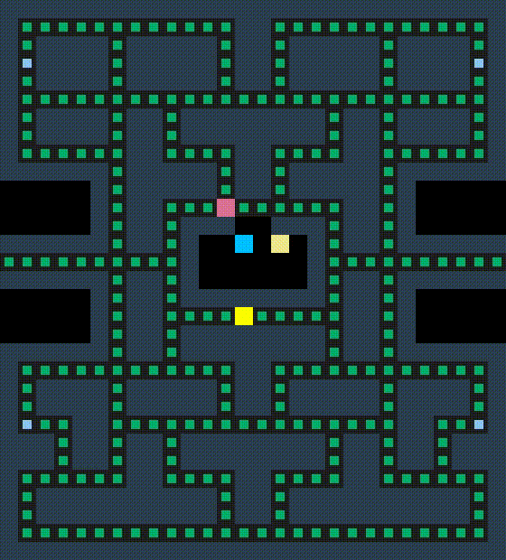

# CPPND: Capstone Project - PacMan

This is the repository of my Capstone project for the [C++ Developer Nanodegree program](https://www.udacity.com/course/c-plus-plus-nanodegree--nd213)

I decided to make a simplified version of the well known '80s arcade game: PacMan! This project was based on a [Snake Game starter code](https://github.com/udacity/CppND-Capstone-Snake-Game) provided by Udacity. The code for this starter repo was inspired by [this](https://codereview.stackexchange.com/questions/212296/snake-game-in-c-with-sdl) excellent StackOverflow post and set of responses.

This Capstone project gave me the chance to apply what I've learned throughout this program by creating an arcade game!

## Dependencies for Running Locally
* cmake >= 3.7
  * All OSes: [click here for installation instructions](https://cmake.org/install/)
* make >= 4.1 (Linux, Mac), 3.81 (Windows)
  * Linux: make is installed by default on most Linux distros
  * Mac: [install Xcode command line tools to get make](https://developer.apple.com/xcode/features/)
  * Windows: [Click here for installation instructions](http://gnuwin32.sourceforge.net/packages/make.htm)
* SDL2 >= 2.0
  * All installation instructions can be found [here](https://wiki.libsdl.org/Installation)
  * Note: OpenCV can also be easily installed using homebrew
  * Note_2: For Linux, an `apt` or `apt-get` installation is preferred to building from source.
* gcc/g++ >= 5.4
  * Linux: gcc / g++ is installed by default on most Linux distros
  * Mac: same deal as make - [install Xcode command line tools](https://developer.apple.com/xcode/features/)
  * Windows: recommend using [MinGW](http://www.mingw.org/)

## Basic Build Instructions

1. Clone this repo.
2. Make a build directory in the top level directory: `mkdir build && cd build`
3. Compile: `cmake .. && make`
4. Run it: `./PacMan`.

## How to Play
- Keyboard Up: Move Pacman Up
- Keyboard Down: Move Pacman Down
- keyboard Left: Move Pacman Left
- Keyboard Right: Move Pacman Right
- Keyboard CTRL + C: Exit Game or hit the 'X' button of the window

 

## Project Specifications aka Rubric
This project meets Udacity's rubric requirements - See below for more information:

### README
| Criteria | Meets Specifications |
| -------- | -------------------- |
| A README with instructions is included with the project | The README is included with the project and has instructions for building/running the project. If any additional libraries are needed to run the project, these are indicated with cross-platform installation instructions. You can submit your writeup as markdown or pdf. |
| The README indicates which project is chosen.| The README describes the project you have built. The README also indicates the file and class structure, along with the expected behavior or output of the program. |
| The README includes information about each rubric point addressed. | The README indicates which rubric points are addressed. The README also indicates where in the code (i.e. files and line numbers) that the rubric points are addressed. |
 

### Compiling & Testing
| Criteria | Meets Specifications |
| -------- | -------------------- |
| The submission must compile and run. | The project code must compile and run without errors. We strongly recommend using cmake and make, as provided in the starter repos. If you choose another build system, the code must compile on any reviewer platform. |
|
 

### Loops, Functions, I/O
| Criteria | Meets Specifications |
| -------- | -------------------- |
| The project demonstrates an understanding of C++ functions and control structures. | The project is clearly organized into function in class Game, Agent, PacMan, Ghost, Controller, Map and Renderer |
| The project reads data from a file and process the data, or the program writes data to a file. | The map file is loaded to from the map.txt file. |
| The project accepts user input and processes the input. | User can create new map files and provide the path to the command line as an argument. For example, when running the game one can type: "./PacMan /maps/level_2_test.txt" and the game will load this one instead of the default one. |

 

### Object Oriented Programming
| Criteria | Meets Specifications |
| -------- | -------------------- |
| The project uses Object Oriented Programming techniques. | Class Game, Agent, PacMan, Ghost, Controller, Map, Renderer are used to organized the code into classes with class attributes to hold the data, and class methods to perform tasks|
| Classes use appropriate access specifiers for class members. | Access to all class data member are explicitly specified as public, private in class Game, Agent, PacMan, Ghost, Controller, Map, Renderer |
| Class constructors utilize member initialization lists. | All class members that are set to argument values are initialized through member initialization lists |
| Classes abstract implementation details from their interfaces.| All class member functions document their effects, either through function names, comments, or formal documentation. Member functions do not change program state in undocumented ways. |
| Classes encapsulate behavior. | Appropriate data and functions are grouped into classes. Member data that is subject to an invariant is hidden from the user. State is accessed via member functions.
| Classes follow an appropriate inheritance hierarchy. | Class PacMan and Ghost (Derived) inherit from class Agent (Base) |
| Derived class functions override virtual base class functions.| A member function in an inherited class overrides a virtual base class member function. See pacman.cpp/Intialize() and ghost.cpp/Initialize().|

 

### Memory Management

| Criteria | Meets Specifications |
| -------- | -------------------- |
|The project makes use of references in function declarations.| At least two variables are defined as references, or two functions use pass-by-reference in the project code.|